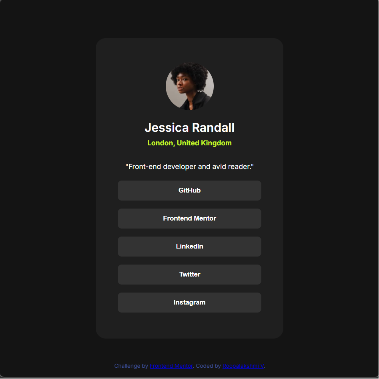

# Social links profile

This is my solution to the social link profiles challenge in Frontend Mentor. The social link profile have a image of the person, location and their social media account links as button.

## Table of contents

- [Overview](#overview)
  - [The challenge](#the-challenge)
  - [Screenshot](#screenshot)
  - [Links](#links)
- [My process](#my-process)
  - [Built with](#built-with)
  - [What I learned](#what-i-learned)
  - [Continued development](#continued-development)
  - [Useful resources](#useful-resources)
  - [AI Collaboration](#ai-collaboration)
- [Author](#author)


## Overview

### The challenge

Users should be able to:
- View the social link profile matching the provided design.
- See hover and active statess for interactive elements
- Experience a responsive layout across different screen sizes
 

### Screenshot




### Links

- Solution URL: 
- Live Site URL: (https://roopa-59.github.io/social-links-profile/)

## My process

### Built with

- Semantic HTML5 markup
- CSS custom properties
- Flexbox
- Responsive design
- Google fonts (Inter)


### What I learned

This project helped me understand several important concepts.

### 1. Flex Property

At first, I add a display property flex to body. After that I use center to justify-content. but vertically only it centered not horizontally.

I learned that if we want our card in center of the body, we have to center it both main and column axis. Adding `align-content: center` allowed it center both horizontally and vertically.

```css
body
{
  background-color: hsl(0, 0%, 8%);
  display: flex;
  justify-content: center;
  align-items: center;
  min-height: 100vh;
  font-family: "Inter", sans-serif;
}
```
### 2. Removing the border to button

When designing the button, somewhat it doesnot look like a design. Initially I remove the shadow by none using `box-shadow-none`. Still it is not same as design after refering I came to know that it is border-radius not shadow property. So I remove it then it is exactly like the design.

```css
.btn-primary
{
  height: 2.5rem;
  width: 100%;
  background-color: hsl(0, 0%, 20%);
  color: hsl(0, 0%, 100%);
  margin: 0.5rem 0;
  border: none;
  border-radius: 0.5rem;
  font-weight: 700;
  transition: background-color .25s, color .25s;
}
```

### Continued development

In future projects, I would like to improve the following skills:

- Writing cleaner and more organized CSS
- Using CSS variables for colors and spacing
- Learning CSS Grid layouts
- Improving accessibility by adding better focus styles
- Following a mobile-first workflow more consistently

### Useful resources

- **Frontend Mentor** – Helped me practice building real-world UI components.
- **MDN Web Docs** – Used to understand CSS properties and HTML semantics.
- **Google Fonts** – Used to include the Figtree font family.

### AI Collaboration

I used ChatGPT as a learning assistant throughout this project.

It helped me:

- Understand why some CSS properties were not working.
- Debug layout issues.
- Understand Flexbox alignment.
- Improve my CSS structure and responsiveness.

Instead of generating the complete solution, I used AI mainly to understand concepts, identify mistakes, and learn best practices while implementing the project myself.

## Author

- GitHub: https://github.com/roopa-59
- Frontend Mentor: https://www.frontendmentor.io/profile/roopa-59

